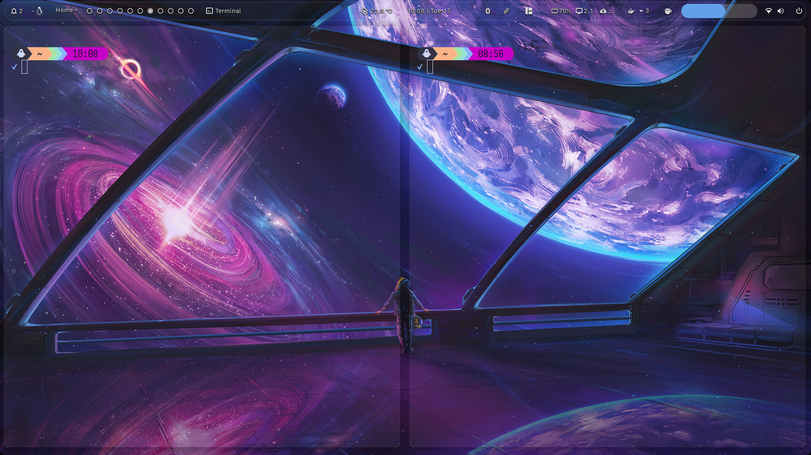
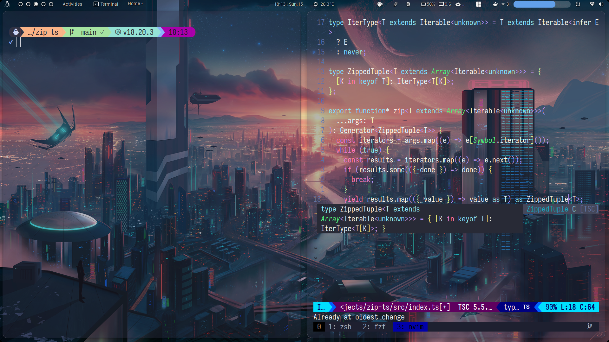
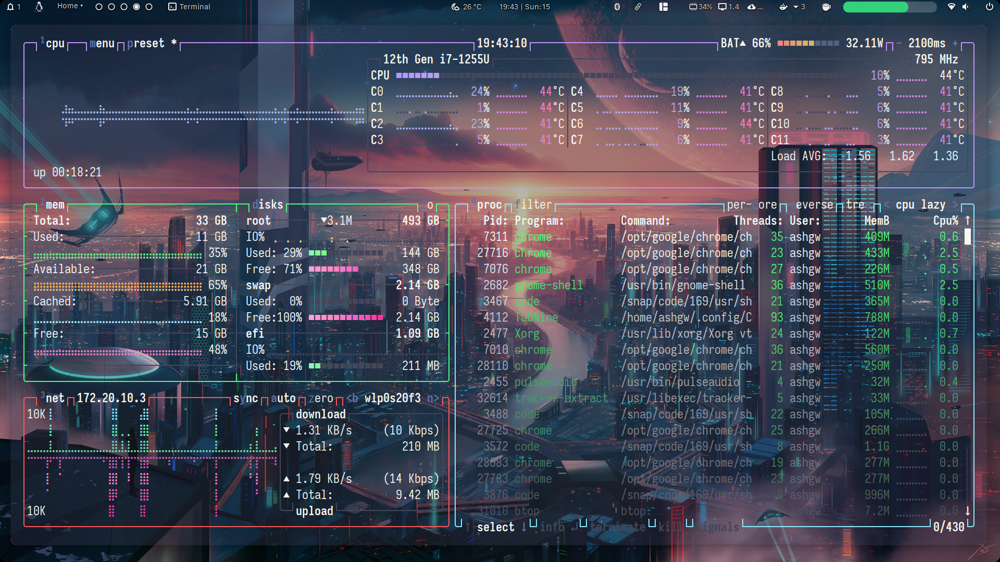
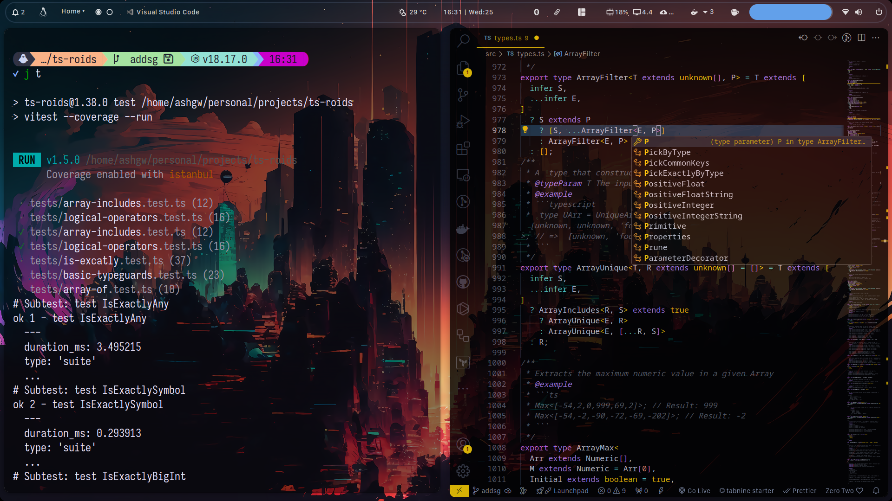
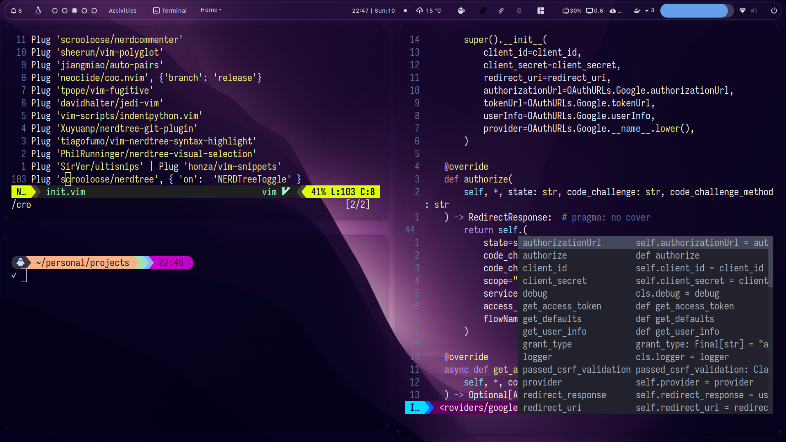

### Setup
#### Me
```shell
g cl --recurse-submodules git@github.com:ashgw/dotfiles.git
```
#### Not me

This will work on any POSIX machine, to:
- Configure the terminal (ZSH, starship, zioxde, etc...)
- SSH [setup](./.ssh/_gh_gen.sh)
- Neovim, TMUX, FZF...
- Nix
- [Packages](./install/bootsrap) I use
- [Languages](./install/arbitrary) I use
- Git [configuration](./.gitconfig), (Aliases, multiple accounts, etc...)

Run:
```shell
bash <(curl -L ashgw.me/api/v1/bootstrap)
```


### Overview
##### New
 <div style="flex: 1; min-width: 200px; margin: 5px;">
    
  </div>


<div style="flex: 1; min-width: 200px; margin: 5px;">
    
  </div>

 <div style="flex: 1; min-width: 200px; margin: 5px;">
    
  </div>

 <div style="flex: 1; min-width: 200px; margin: 5px;">
    
  </div>

 <div style="flex: 1; min-width: 200px; margin: 5px;">
    
  </div>
  <div style="flex: 1; min-width: 200px; margin: 5px;">
    
  </div>

### Workflow

1- A ton of aliases, even aliasing the aliases, I don't like mental overhead, if it takes more than 3 words to type, it has to be aliased. So this what I usually type, it might not make sense to you, but it makes a lot of sense to me

```shell
dprune && lpg && g ck -b dev && j t && j l && v . && c && gh
```

2- Mediocre rice

3- Neovim, tmux & fzf? Yes
