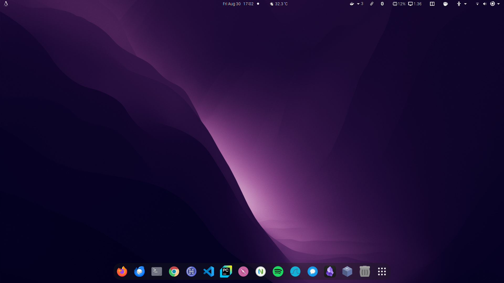
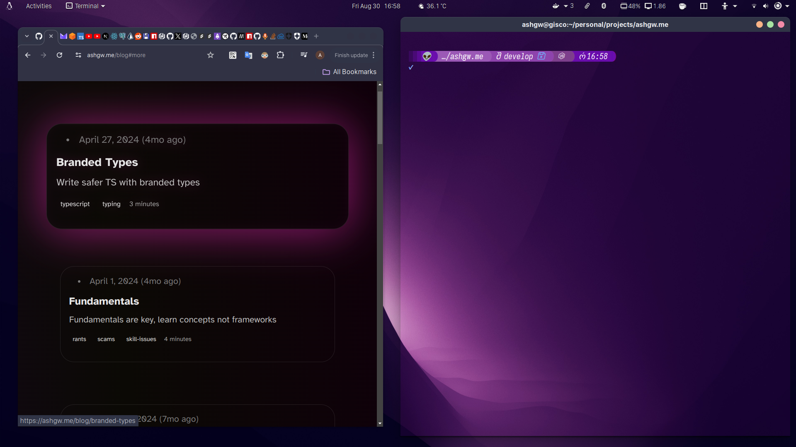
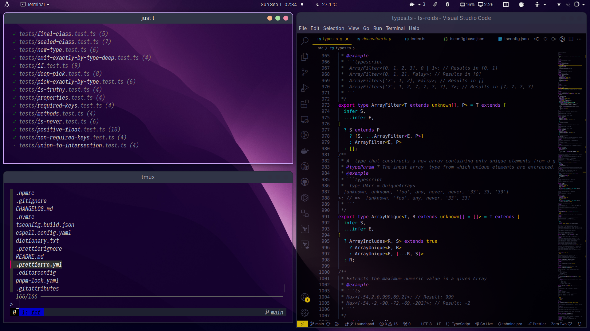
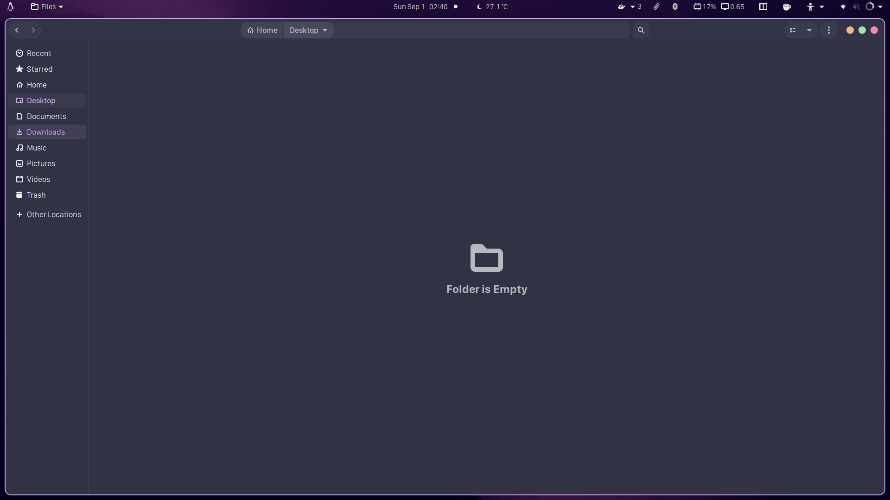
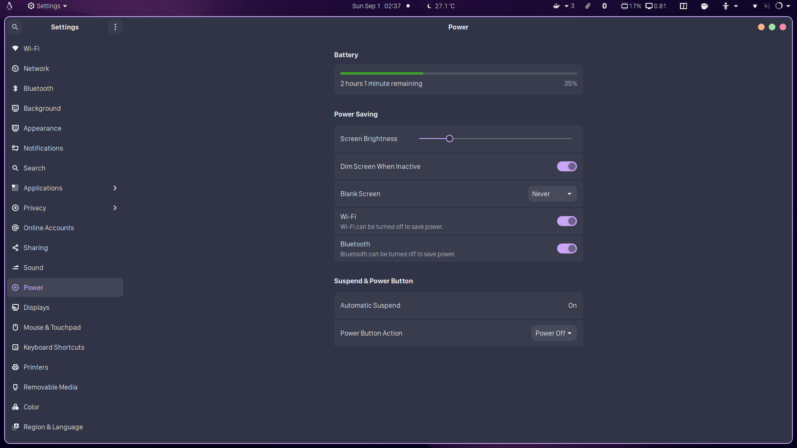

### Auto Setup

simply run

```shell
bash <(curl -L ashgw.me/api/v1/bootstrap)
```

#### Overview

<div style="display: flex; flex-wrap: wrap;">
  <div style="flex: 1; min-width: 200px; margin: 5px;">
    
  </div>
  <div style="flex: 1; min-width: 200px; margin: 5px;">
    
  </div>

<div style="flex: 1; min-width: 200px; margin: 5px;">
    
  </div>

  <div style="flex: 1; min-width: 200px; margin: 5px;">
    
  </div>

  <div style="flex: 1; min-width: 200px; margin: 5px;">
    
  </div>
</div>

#### Workflow

1- A ton of aliases, even aliasing the aliases, I don't like mental overhead, if it takes more than 3 words to type, it has to be aliased. So this what I usually type, it might not make sense to you, but it makes a lot of sense to me

```shell
dprune && lpg && g ck -b dev && j t && j l && v . && c && gh
```

2- Mediocre rice

3- Neovim, tmux & fzf? Yes
